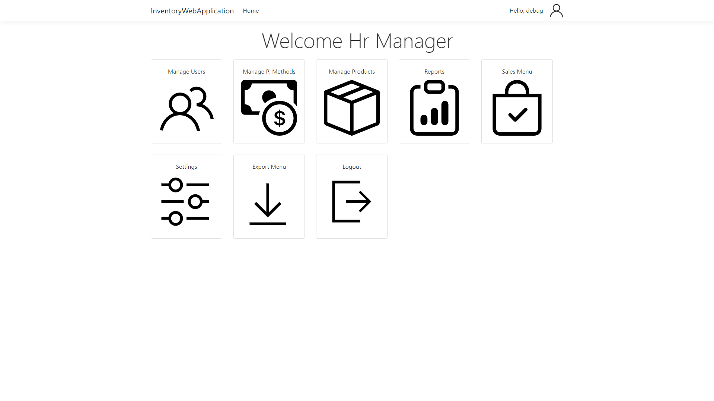
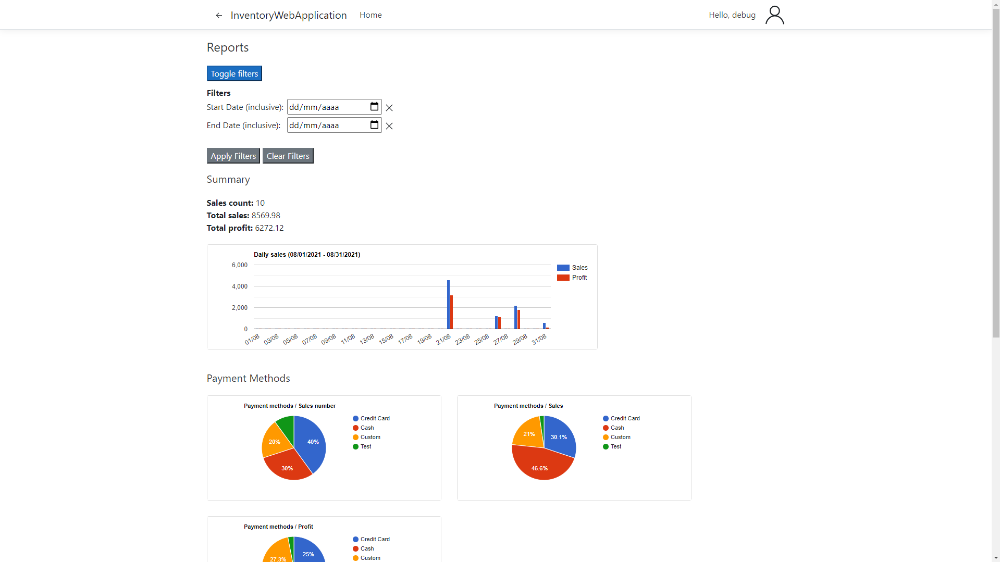
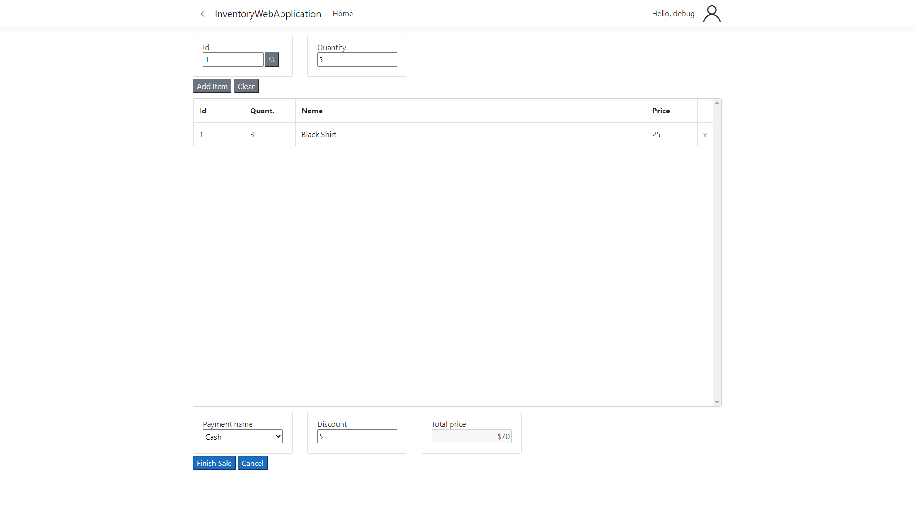

# InventoryWebApplication
An expandable inventory management system built with ASP.Net Core. It allows users to create and sell products and generates reports based on sales time, seller, and payment method.

## Features
- Interface made with Razor Pages, HTML, CSS and JS
- Pages to add, delete, and edit users, payment methods, and products.
- Login and logout
- Cookie authentication
- Roles: Hr Manager, Stock Manager, and Seller
- SQLite database integrated with Entity Framework
- Option to export tables to CSV and JSON
- Storage sales' information: seller, time, price, profit, discount, payment method, and products
- Reports based on sales time, seller, and payment method
- Sales menu:
  - Adding a product by id or searching by the name
  - Ability to give discount: flat and percentage
- Logging of every request

### Home

### Reports

### Sales Menu

##### Default user:
Name: debug
Password: debug